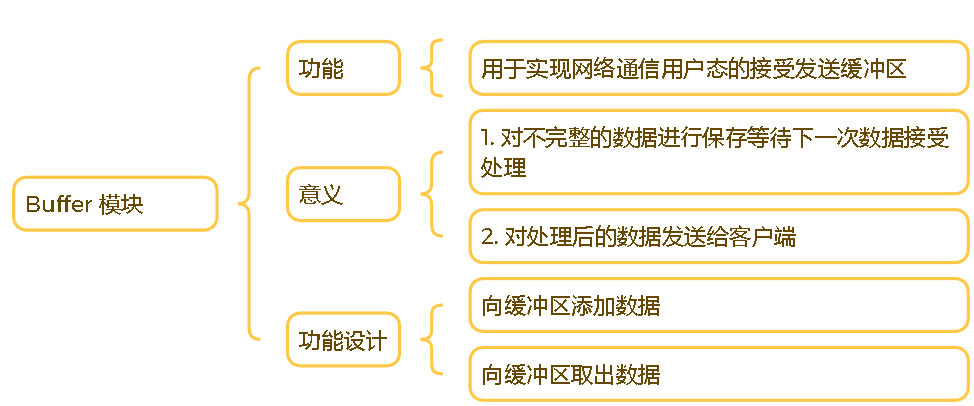
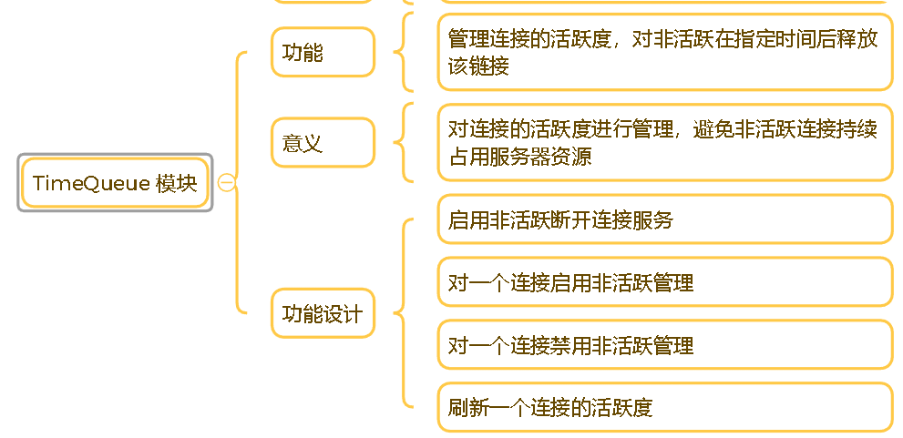
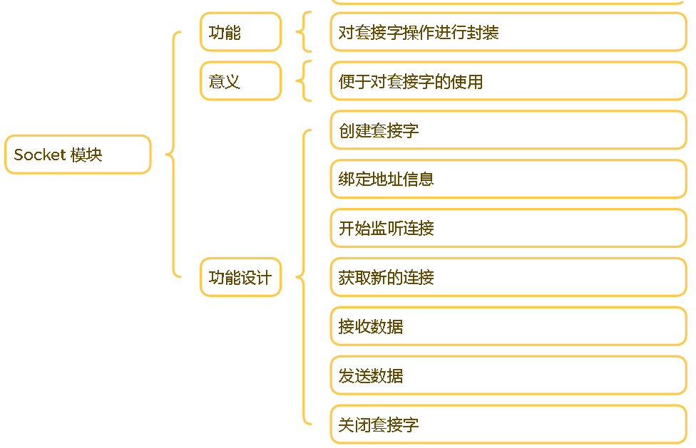

## 仿 muduo 库的 one thread one loop 并发服务器

## 一、Server 模块

&emsp;该模块对所有的连接进行管理：

- 监听连接管理：监听连接请求，建立新的连接
- 通信连接管理：管理建立的连接发起的事件请求
- 超时连接管理：对超时的连接进行处理（断开 ）

根据上述目的需求，我们再次将功能划分为子模块：

### 1. Buffer 模块

 #### 1.1 模块概述

&emsp;该模块主要是使用一个缓冲区来保存当前通信的接收发送数据，具体的思路如下：

#### 1.2 实现思想

&emsp;使用数据结构 vector<char> 来当作存储数据的容器，同时我们主要的操作是对数组进行读 / 写 / 幻读，在这里的幻读也就是读数据，但是并不将数据从缓冲区中取出来，因为可能存在数据取出不完整的情况，我们需要等待下一次读事件触发再取出判断，主要依靠三个指针：

- 读指针：当前读取的开始位置
- 写指针：当前写入的开始位置
- fake指针：当前幻读的位置

至于为什么不使用 string 来当作容器，是因为首先 string 在处理数据时遇到 \0 会被截断，网络发送数据中极有可能字符，这样会导致数据无法被正确的处理。其次，string 的函数大多都是针对于处理文本数据的，我们对缓冲区的操作大多都是针对空间，使用 vector 更加的方便。

### 2. TimeQueue 模块

#### 2.1 模块概述

&emsp;该模块主要负责监控连接的活跃度，当某个连接在规定时间都是处于非活跃状态就会断开该连接（如果启动了这个功能），具体如下：

#### 2.2 实现思想

&emsp;在这里采用了时间轮的思想，大体是设计一个环形数组（数组的长度就是规定的时间段），每隔指定的时间（可以使用 timerfd）指向时间轮的索引就会前进一格，每到新的一格就执行该位置存储的任务。（可能一个位置存储多个任务，所以我们每一个位置使用 list，便于插入任务）这样随着时间的增加，就会不断地触发定时任务。

&emsp;但是我们还有一个极其重要地功能就是刷新任务活跃度，怎么刷新活跃度使之前存在于时间轮的任务不再被执行呢。使用到了智能指针 shared_ptr ，并且将任务包装为一个对象 TimeTask，将定时任务设置到该对象的析构函数中。当我们添加一个新的定时任务时：

- 首先创建一个任务对象，并且将该任务的 id（上层提供）和 weak_ptr 以键值对的形式保存在哈希表中
- 将该任务以智能指针德形式添加到时间轮中
- 当刷新任务时，根据任务 id 找到该任务的 weak_ptr ，构造一个 shared_ptr  再次添加到时间轮中

为什么使用智能指针 shared_ptr 呢？该指针存在引用计数，只有最后一个指针销毁时才会析构指向的资源，也就是执行定时任务。所以当我们的时间轮存在多个定时任务对象指针的时候，就不会因为单个指针析构从而执行定时器任务了。那为什么使用 weak_ptr 来保存时间轮中存在的任务呢？使用 weak_ptr 构造的 shared_ptr 才会共享同一个引用计数，这样才不会导致其他内存问题。

### 3.  Socket 模块

#### 2.1 模块概述

&emsp;封装我们常用的套接字编程函数，使我们更为方便的操作，具体如下：

#### 2.2 实现思想

&emsp;主要就是封装函数，更方便的建立一个监听套接字，以及发起连接请求，并且所有的套接字操作都是非阻塞的，需要结合之后的回调函数设置以及事件监听，其余没什么特别的设计。

