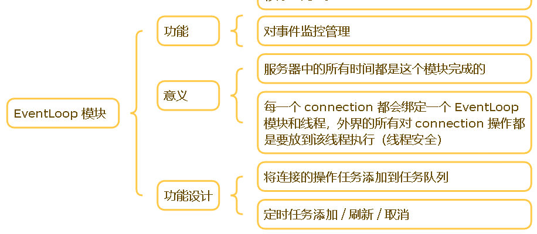

## 仿 muduo 库的 one thread one loop 并发服务器

## 一、Server 模块

&emsp;该模块对所有的连接进行管理：

- 监听连接管理：监听连接请求，建立新的连接
- 通信连接管理：管理建立的连接发起的事件请求
- 超时连接管理：对超时的连接进行处理（断开 ）

根据上述目的需求，我们再次将功能划分为子模块：

### 1. Buffer 模块

 #### 1.1 模块概述

&emsp;该模块主要是使用一个缓冲区来保存当前通信的接收发送数据，具体的思路如下：

#### 1.2 实现思想

&emsp;使用数据结构 vector<char> 来当作存储数据的容器，同时我们主要的操作是对数组进行读 / 写 / 幻读，在这里的幻读也就是读数据，但是并不将数据从缓冲区中取出来，因为可能存在数据取出不完整的情况，我们需要等待下一次读事件触发再取出判断，主要依靠三个指针：

- 读指针：当前读取的开始位置
- 写指针：当前写入的开始位置
- fake指针：当前幻读的位置

至于为什么不使用 string 来当作容器，是因为首先 string 在处理数据时遇到 \0 会被截断，网络发送数据中极有可能字符，这样会导致数据无法被正确的处理。其次，string 的函数大多都是针对于处理文本数据的，我们对缓冲区的操作大多都是针对空间，使用 vector 更加的方便。

### 2. TimeWheel 模块

#### 2.1 模块概述

&emsp;该模块主要负责监控连接的活跃度，当某个连接在规定时间都是处于非活跃状态就会断开该连接（如果启动了这个功能），具体如下：

#### 2.2 实现思想

&emsp;在这里采用了时间轮的思想，大体是设计一个环形数组（数组的长度就是规定的时间段），每隔指定的时间（可以使用 timerfd）指向时间轮的索引就会前进一格，每到新的一格就执行该位置存储的任务。（可能一个位置存储多个任务，所以我们每一个位置使用 list，便于插入任务）这样随着时间的增加，就会不断地触发定时任务。

&emsp;但是我们还有一个极其重要地功能就是刷新任务活跃度，怎么刷新活跃度使之前存在于时间轮的任务不再被执行呢。使用到了智能指针 shared_ptr ，并且将任务包装为一个对象 TimeTask，将定时任务设置到该对象的析构函数中。当我们添加一个新的定时任务时：

- 首先创建一个任务对象，并且将该任务的 id（上层提供）和 weak_ptr 以键值对的形式保存在哈希表中
- 将该任务以智能指针德形式添加到时间轮中
- 当刷新任务时，根据任务 id 找到该任务的 weak_ptr ，构造一个 shared_ptr  再次添加到时间轮中

为什么使用智能指针 shared_ptr 呢？该指针存在引用计数，只有最后一个指针销毁时才会析构指向的资源，也就是执行定时任务。所以当我们的时间轮存在多个定时任务对象指针的时候，就不会因为单个指针析构从而执行定时器任务了。那为什么使用 weak_ptr 来保存时间轮中存在的任务呢？使用 weak_ptr 构造的 shared_ptr 才会共享同一个引用计数，这样才不会导致其他内存问题。

### 3.  Socket 模块

#### 2.1 模块概述

&emsp;封装我们常用的套接字编程函数，使我们更为方便的操作，具体如下：

#### 2.2 实现思想

&emsp;主要就是封装函数，更方便的建立一个监听套接字，以及发起连接请求，并且所有的套接字操作都是非阻塞的，需要结合之后的回调函数设置以及事件监听，其余没什么特别的设计。

### 4. channel 模块

#### 4.1 模块概述

&emsp;该模块主要的功能是管理对描述符监控的事件（增删改查），以及设定回调函数（上层设定）便于触发事件后进行处理，详细如下：

#### 4.2 实现思想

&emsp;该模块对外提供的接口主要是更新需要监控的事件，以及回调函数。但是 channel 自己底层并不会去实现对描述符进行事件监控的逻辑（统一交给 Poller 模块管理），每次进行修改后只需要告诉上层即可。所以在这个类中，我们的主要工作主要是：

- 设置管理的描述符
- 设置需要监控的事件
- 设置各种事件的回调函数
- 触发特定事件进行需要函数调用
- 通知上层，自己监控事件的改变

这个模块主要是封装了描述符，给予关心事件类型，事件回调，事件处理的属性。

### 5. Poller 模块

#### 5.1 模块概述

&emsp;该模块的主要功能首先是封装 epoll 相关的函数，然后对外提供增添事件监控，修改事件监控，删除事件监控，返回发生事件的接口，具体如下：

 

#### 5.2 实现思想

&emsp;该模块结合 channel 模块已经具备对指定事件的进行监控以及处理的能力，channel 主要负责：

- epoll 中描述符的监控事件的管理（增删改）

- 等待事件发生；将发生事件的类型设定到 channel 中；返回所有发生事件的 channel

Poller 模块是真正底层进行事件监控的模块。

### 6. EventLoop 模块

#### 6.1 模块概述

&emsp;该模块整合了前面完成的 TimeQueue 模块、Poller 模块、Channel 模块，现在我们只需要将描述符封装为 channel 再挂到 EventLoop 上，就可以自动的完成事件监控，事件处理，超时断开，详细如下：

#### 6.2 实现思想

&emsp;该模块需要将前几个模块的功能整合，整体的功能如下：

- 对描述符事件的管理（增删改查）
- 对定时器的管理（启动，增加，刷新）

但是存在一个线程安全的问题，因为该服务器框架是一个主从 Reactor 模型，主线程主要负责接受连接，每个子线程对应一个 EventLoop，EventLoop 存在的数据结构主要有 时间轮（存储定时任务），Epoll（事件管理），如果主线程在使用的同时子线程也在使用，那么可能会触发数据不一致的问题等多线程安全问题。所以主线程涉及到对子线程数据进行操作的地方，需要特殊处理。我们并不直接进行操作，而是将该任务放到子线程的任务队列中，之后让子线程自己处理，这样就不会出现问题。

&emsp;EventLoop 的结构体大致如下：

 

### 7. Connection 模块

#### 7.1 模块概述

&emsp;对一个连接进行全方位的管理，对通信连接的所有操作都是提供这个模块完成的：

 

#### 7.2 实现思想

&emsp;首先是设置对一个套接字的最基本的事件：读 / 写 / 挂断 / 任意，将这些事件预先设定到 Channel 中管理；提供用户的回调函数管理：连接建立 / 数据接收 / 连接关闭 / 任意事件，将这些函数设定到基本函数回调中。

&emsp;对缓冲区的管理，为了更好的管理连接需要发送和接受的数据，分别创建读写缓冲区管理数据。

&emsp;为连接创建一个状态，这非常重要。每个连接有了相应的状态，才可以在执行任务之后选择是否执行相应的操作（比如如果一个连接需要关闭，那么在执行完写事件之后，我们就需要关闭该连接。）

&emsp;这个模块主要负责整合前几个模块的功能，并且引入用户的回调函数，然后为设定相关的状态，前面理解了这个也不难。

### 8. Accepter 模块

#### 8.1 模块概述

&emsp;和 Connection 功能类似，对一个监听套接字进行全方位的管理，对监听套接字的所有操作都是提供这个模块完成的：

#### 8.2 实现思想

&emsp;一个监听套接字需要关心的事件也只有 读 事件，也接受新连接。接受新连接之后我们需要将新的连接进行管理，但是具体怎么管理需要用户提供，所以我们需要提供一个回调函数来处理新的连接。

&emsp;当然，监听套接字不需要设置非活跃度连接。所以，Acceptor 模块整体还是比较简单的。

>注意：对监听套接字的写事件监控需要在设置用户回调函数之后。当监听套接字开始监控时，会调用对应的事件回调，但是用户级别的回调函数还没设置好，那么执行逻辑就出问题了

### 9. LoopThread + ThreadPool 模块

#### 9.1 模块概述

&emsp;一个 EventLoop 和一个线程是一一对应的，所以我们需要在每个线程中初始化一个 EventLoop，主线程中的 base_loop 负责接受连接（如果用户设置子线程数量为 0 那么所有工作在主线程完成），其余从属子线程被 ThreadPool 管理，负责连接事件的监控和处理。

 

#### 9.2  实现思想

&emsp;EventLoop 中存在一个属性是 thread_id ，所以 EventLoop 的创建放在他对应的线程中进行。如果放在主线程中创建，那么后续需要切换 thread_id 为对应的线程，存在空挡时间有线程安全问题。所以整体实现逻辑是：

- 将 EventLoop 交由 LoopThread 管理，负责创建新的线程并且开始事件监控
- 将多个 EventLoop 交由 LoopThreadPool 管理，负责创建 LoopThread，并且分配新连接对应的 EventLoop

这里需要注意，LoopThreadPool 中也包含一个 base_loop 专门管理监听套接字的事件，如果用户设置从属线程的数量为 0，则所有事件的管理交给 base_loop。

### 10. TcpServer

#### 10.1 模块概述

&emsp;该模块是对 Acceptor 以及 ThreadPool 的整合，更方便的创建服务器对象，搭建一个服务器：

#### 10.2 实现思想

&emsp;内部需要管理的对象如下:

- Acceptor：创建监听套接字接受新的连接、
- EventLoop：创建 base_loop 管理 Acceptor 的事件（如果从属线程 == 0，负责所有事件的监控）
- ThreadPool：从属线程，负责监控连接的事件以及分配 EventLoop
- unordered_mao<int, connection*>：管理 Connection 对象

工作流程如下：

1. 在 TcpServer 中创建一个 Acceptor 对象，以及 EventLoop 对象
2. 将 Acceptor 挂到 base_loop 上进行事件监控
3. 将 Acceptor 接收到的新连接创建为 Connection
4. 设置各类回调函数，将 Connection 挂到从属线程中管理

### 11. HttpServer

&emsp;其实到模块 10 为止，我们这个服务器框架就搭建完成了。现在的工作是在服务器的基础上搭建一个很常用的应用层协议 HTTP，熟悉 HTTP 的工作流程。

#### 11.1 模块概述

&emsp;首先我们需要完成的任务如下：

- Util：一个工具类，提供常用的文件操作，读 / 写 / 分割 / 获取后缀等
- HttpContext：保存处理上下文，因为有可能存在数据不完整的情况，我们需要等到下一次数据就绪再处理，所以我们需要保存上下文，最后将一个完整的请求解析为 HttpRequest
- HttpRequest：解析 HTTP 请求数据的各项字段数据（请求方法 / 资源路径 /  headers / body）
- HttpResponse：保存设置的响应字段信息（状态码 / 状态描述 / headers / body），最后组织为一个 HTTP 响应报文
- HttpServer：负责管理上述所有功能以及设置 TcpServer 接受连接回调函数（设置上下文），设置 TcpServer 接受数据回调函数；并且对外提供路由表设置（资源路径处理方法）

 

#### 11.2 实现思想

&emsp;我们主要介绍 HttpContext 类，这个类负责管理协议处理的上下文。所以我们接受新的连接时，需要将 OnConncted 回调函数设置为设置上下文类型。当我们处理数据时，需要得到上次的处理的位置在哪里， HTTP 请求报文的格式如下：

所以总体来说分三个位置：首行 / 头部 / 正文；所以思路是：

- 初始化枚举类型：LINE / HEADER / BODY
- 初始化枚举变量为 LINE
- 每当我们完全解析了一个字段的数据（字段之间空行隔开，根据这个判断数据是否解析完全），就进入下一个阶段
- 当我们处理数据时，只需要判断枚举变量的值即可知道需要从哪里开始解析数据

同时我们需要我们将我们已经解析的信息放到 httpRequest 中，便于后续使用。

